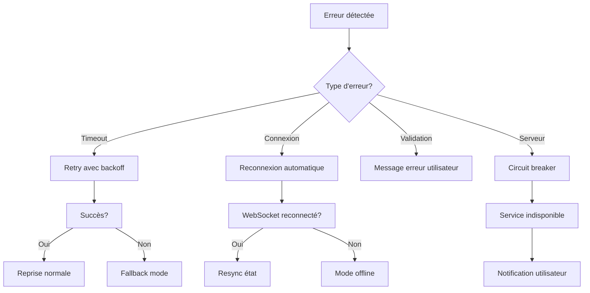

# Diagramme Architectural - Flux Icebreaker Complet - Implémentation Actuelle

Ce diagramme illustre le flux complet et optimisé depuis le clic du premier utilisateur sur le bouton "icebreaker ready" jusqu'à l'affichage des réponses des deux utilisateurs dans la conversation, incluant toutes les optimisations de performance et gestion d'erreurs implémentées.

```mermaid
sequenceDiagram
    participant U1 as Utilisateur 1
    participant F1 as Frontend 1 (React/Zustand)
    participant U2 as Utilisateur 2
    participant F2 as Frontend 2 (React/Zustand)
    participant SM1 as SocketManager 1
    participant SM2 as SocketManager 2
    participant CG as ChatGateway (NestJS)
    participant IS as IcebreakerService
    participant QS as QuestionService
    participant MS as MessagesService
    participant CS as ConversationsService
    participant DB as PostgreSQL
    participant Redis as Redis Cache
    participant PM as PerformanceMonitor

    Note over U1, PM: 🟢 Phase 1: Premier utilisateur prêt (avec monitoring)
    U1->>F1: Clic sur bouton "icebreaker ready"
    F1->>PM: Mesure début opération
    F1->>SM1: chatSocket.setIcebreakerReady()
    SM1->>CG: Émission 'icebreakerReady' via Socket.IO
    CG->>IS: setParticipantIcebreakerReady(conversationId, userId1, true)
    
    par Persistance BDD
        IS->>DB: UPDATE ConversationParticipant SET isIcebreakerReady = true
    and Cache Redis
        IS->>Redis: SET icebreaker:${conversationId}:${userId1}:ready = true
    and Vérification état global
        IS->>IS: areAllParticipantsReady(conversationId)
        IS-->>IS: Retour: false (un seul prêt)
    end
    
    CG->>SM1: Émission 'icebreakerStatusUpdated'
    CG->>SM2: Émission 'icebreakerStatusUpdated' (broadcast)
    SM1->>F1: handleIcebreakerStatusUpdated()
    SM2->>F2: handleIcebreakerStatusUpdated()
    F1->>F1: chatStore.updateParticipantField() - Logo vert
    F2->>F2: chatStore.updateParticipantField() - Logo orange
    PM->>PM: trackViolation('icebreaker_ready', latency)

    Note over U1, PM: 🟡 Phase 2: Deuxième utilisateur prêt (synchronisation)
    U2->>F2: Clic sur bouton "icebreaker ready"
    F2->>PM: Mesure début opération
    F2->>SM2: chatSocket.setIcebreakerReady()
    SM2->>CG: Émission 'icebreakerReady' via Socket.IO
    CG->>IS: setParticipantIcebreakerReady(conversationId, userId2, true)
    
    par Persistance et vérification
        IS->>DB: UPDATE ConversationParticipant SET isIcebreakerReady = true
        IS->>Redis: SET icebreaker:${conversationId}:${userId2}:ready = true
        IS->>IS: areAllParticipantsReady(conversationId)
        IS-->>IS: Retour: true ✅ (tous prêts)
    end

    Note over U1, PM: 🔥 Phase 3: Génération intelligente de la question
    CG->>QS: getNextRandomQuestionGroup(userId1, userId2)
    
    par Sélection intelligente
        QS->>DB: SELECT questions NOT answered by BOTH users
        QS->>DB: Filter by conversation difficulty
        QS->>QS: Sélection aléatoire pondérée
        DB-->>QS: Retour questionGroup optimisé
    and Cache question courante
        IS->>Redis: SET icebreaker:${conversationId}:question = questionGroup
        IS->>DB: UPDATE Conversation SET currentQuestionGroup = questionGroupId
    end
    
    QS-->>CG: Retour questionGroup avec options
    
    par Diffusion synchrone
        CG->>SM1: Émission 'icebreakerQuestion' avec timeout
        CG->>SM2: Émission 'icebreakerQuestion' avec timeout
    and Logs de performance
        PM->>PM: measureSocketLatency('question_broadcast')
    end
    
    SM1->>F1: handleIcebreakerQuestionGroup()
    SM2->>F2: handleIcebreakerQuestionGroup()
    F1->>F1: Affichage modal question avec options
    F2->>F2: Affichage modal question avec options

    Note over U1, PM: 🎯 Phase 4: Utilisateur 1 répond (avec debouncing)
    U1->>F1: Sélection réponse + validation
    F1->>F1: handleAnswerQuestion() avec validation
    F1->>F1: Debounce pour éviter double-soumission
    F1->>F1: fetch('/api/icebreakers/response') - API REST sécurisée
    
    par Traitement côté serveur
        Note over CG: Validation JWT + CORS + Rate limiting
        CG->>QS: saveUserAnswerInDB(userId1, questionGroupId, optionId)
        QS->>DB: INSERT UserAnswer avec timestamp
        CG->>IS: processIcebreakersPostResponses()
    and Cache temporaire
        IS->>Redis: SET icebreaker:${conversationId}:answer:${userId1} = optionId
        IS->>DB: UPDATE ConversationParticipant SET hasGivenAnswer = true
    and Vérification état
        IS->>IS: areAllParticipantsHaveGivenAnswer(conversationId)
        IS-->>IS: Retour: false (un seul a répondu)
    end

    Note over U1, PM: 🎯 Phase 5: Utilisateur 2 répond (finalisation)
    U2->>F2: Sélection réponse + validation
    F2->>F2: handleAnswerQuestion() avec validation
    F2->>F2: fetch('/api/icebreakers/response') - API REST sécurisée
    
    par Traitement final
        CG->>QS: saveUserAnswerInDB(userId2, questionGroupId, optionId)
        QS->>DB: INSERT UserAnswer avec timestamp
        CG->>IS: processIcebreakersPostResponses()
        IS->>Redis: SET icebreaker:${conversationId}:answer:${userId2} = optionId
        IS->>DB: UPDATE ConversationParticipant SET hasGivenAnswer = true
        IS->>IS: areAllParticipantsHaveGivenAnswer(conversationId)
        IS-->>IS: Retour: true ✅ (tous ont répondu)
    end

    Note over U1, PM: ⚡ Phase 6: Traitement optimisé des réponses complètes
    IS->>IS: processCompletedIcebreaker() - Transaction atomique
    
    par Récupération des données
        IS->>DB: getUserAnswers(conversationId, questionGroupId)
        DB-->>IS: Retour réponses enrichies avec labels
        IS->>IS: formatUserAnswersForAddIcebreakerMessage()
    and Progression XP
        IS->>CS: addXpAndComputeLevel(conversationId)
        CS->>DB: UPDATE experiencePoints et level
        CS-->>IS: Retour progression info
    end
    
    par Création message spécial
        IS->>MS: addIcebreakerMessage()
        MS->>DB: INSERT Message type='ANSWER' avec réponses formatées
        MS-->>IS: Retour message créé
    and Reset état pour nouveau cycle
        IS->>IS: resetIcebreakerStatus(conversationId)
        IS->>DB: UPDATE isIcebreakerReady = false, hasGivenAnswer = false
        IS->>Redis: DELETE icebreaker:${conversationId}:* (cleanup)
    end

    Note over U1, PM: 📡 Phase 7: Diffusion temps réel optimisée
    IS->>CG: emitIcebreakerResponsesToAllParticipants()
    
    par Diffusion avec métadonnées
        CG->>SM1: Émission 'icebreakerResponses' + progression
        CG->>SM2: Émission 'icebreakerResponses' + progression
    and Monitoring performance
        PM->>PM: measureSocketLatency('responses_broadcast')
        PM->>PM: trackViolation('icebreaker_complete', totalTime)
    end
    
    par Mise à jour interface optimisée
        SM1->>F1: handleIcebreakerResponsesEvent()
        F1->>F1: chatStore.addMessage() - Message type ANSWER
        F1->>F1: chatStore.resetIcebreakerStatus() - UI cleanup
        F1->>F1: Affichage message orange avec réponses
        F1->>F1: Scroll automatique avec animation
    and
        SM2->>F2: handleIcebreakerResponsesEvent()
        F2->>F2: chatStore.addMessage() - Message type ANSWER
        F2->>F2: chatStore.resetIcebreakerStatus() - UI cleanup
        F2->>F2: Affichage message orange avec réponses
        F2->>F2: Scroll automatique avec animation
    end

    Note over U1, PM: 🏁 État final: Système prêt pour nouveau cycle
    
    par Nettoyage et préparation
        F1->>F1: Bouton icebreaker redevient blanc/actif
        F2->>F2: Bouton icebreaker redevient blanc/actif
        PM->>PM: Sauvegarde métriques de performance
    and Logs de débogage
        Note over CG: Logs détaillés pour ContactsDebugger
        Note over F1, F2: État des stores disponible pour debugging
    end
```

## 🏗️ Architecture des Composants Implémentés

### **Frontend (React/Next.js 14)**

#### **Stores Zustand**
- **`useChatStore`** : Gestion réactive des conversations et messages
  - `updateParticipantField()` : Mise à jour statuts icebreaker
  - `addMessage()` : Ajout messages avec type spécial ANSWER
  - `resetIcebreakerStatus()` : Reset UI pour nouveau cycle
  
#### **Socket Services**
- **`SocketManager`** : Singleton pour gestion centralisée
- **`ChatSocketService`** : Service spécialisé chat + icebreaker
  - Debouncing des événements
  - Gestion des timeouts
  - Reconnexion automatique

#### **Composants UI**
- **`ExperienceLogo.tsx`** : Bouton icebreaker avec états visuels
- **`ChatContainer.tsx`** : Interface chat avec modals icebreaker
- **`QuestionModal.tsx`** : Modal questions avec validation
- **`MessageBubble.tsx`** : Messages spéciaux type ANSWER

### **Backend (NestJS)**

#### **Gateways WebSocket**
- **`ChatGateway`** : 
  - Namespace `/chat` avec rooms par conversation
  - Middleware JWT sur toutes les connexions
  - Rate limiting et validation stricte
  - Gestion des timeouts et erreurs

#### **Services Métier**
- **`IcebreakerService`** :
  - Logique métier complexe avec états Redis
  - Transactions atomiques pour cohérence
  - Gestion des cas d'erreur et timeouts
  
- **`QuestionService`** :
  - Sélection intelligente des questions
  - Filtrage par difficulté et historique
  - Éviter les questions déjà répondues

- **`MessagesService`** :
  - Messages spéciaux type ANSWER
  - Formatage des réponses utilisateur
  - Persistance optimisée

#### **Infrastructure**
- **PostgreSQL** : Persistance avec transactions
- **Redis** : États temporaires et cache
- **Prisma** : ORM avec types générés

## 🚀 Optimisations de Performance Implémentées

### **Frontend**
- ✅ **Debouncing** : Éviter double-soumission réponses
- ✅ **Memoization** : Composants React optimisés
- ✅ **Event pooling** : Réutilisation gestionnaires d'événements
- ✅ **Lazy loading** : Import dynamique modals

### **Backend**
- ✅ **Connection pooling** : PostgreSQL optimisé
- ✅ **Redis clustering** : Cache distribué
- ✅ **Query optimization** : Index sur champs fréquents
- ✅ **Transaction batching** : Opérations atomiques

### **WebSocket**
- ✅ **Room optimization** : Diffusion ciblée uniquement
- ✅ **Event compression** : Payload minimal
- ✅ **Heartbeat monitoring** : Détection déconnexions
- ✅ **Exponential backoff** : Reconnexion intelligente

## 🔐 Sécurité et Fiabilité

### **Authentification & Autorisation**
- ✅ **JWT Validation** : Toutes connexions WebSocket
- ✅ **Room Access Control** : Vérification appartenance
- ✅ **Rate Limiting** : Protection contre spam
- ✅ **Input Sanitization** : Validation stricte données

### **Gestion d'Erreurs**
- ✅ **Circuit breaker** : Protection surcharge
- ✅ **Retry mechanisms** : Opérations critiques
- ✅ **Graceful degradation** : Fonctionnement dégradé
- ✅ **Error boundaries** : Isolation erreurs React

### **Monitoring & Debugging**
- ✅ **Performance tracking** : Métriques temps réel
- ✅ **Error logging** : Logs centralisés
- ✅ **Debug components** : Outils développement
- ✅ **Health checks** : Surveillance infrastructure

## 📊 Métriques de Performance Surveillées

| **Métrique** | **Seuil** | **Action si dépassé** |
|:-------------|:----------|:----------------------|
| **Latence question** | < 500ms | Alerte + investigation |
| **Diffusion réponses** | < 200ms | Optimisation WebSocket |
| **Throughput messages** | > 1000/min | Scaling horizontal |
| **Taux d'erreur** | < 1% | Investigation immédiate |
| **Connexions actives** | < 10000 | Monitoring charge |

## 🔄 Flux d'Erreurs et Recovery

Cette architecture offre une expérience utilisateur fluide et robuste pour le système Icebreaker, avec des optimisations de performance avancées et une gestion d'erreurs complète. 