# Diagramme UML - Architecture JootsHub - Version Actuelle

Ce diagramme UML présente l'architecture complète et actualisée du projet JootsHub avec toutes les entités, services et leurs relations implémentées.

## Diagramme de Classes

```mermaid
classDiagram
    %% === ENTITÉS UTILISATEUR ===
    class User {
        +string id
        +string username
        +int userNumber
        +boolean isOnline
        +string avatar
        +string bio
        +boolean isAvailableForChat
        +Role role
        +string[] languages
        +Date createdAt
        +Date updatedAt
        +getInitials() string
        +isContactOf(userId: string) boolean
    }

    class UserAttribute {
        +string id
        +string userId
        +AttributeKey key
        +string value
        +int levelRevealed
        +Date createdAt
        +Date updatedAt
    }

    class UserContact {
        +string userId
        +string contactId
        +Date createdAt
    }

    %% === ENTITÉS CONVERSATION ===
    class Conversation {
        +string id
        +LocaleCode locale
        +int xpPoint
        +Difficulty difficulty
        +Date createdAt
        +Date updatedAt
        +ConversationParticipant[] participants
        +Message[] messages
        +Message lastMessage
        +int unreadCount
        +addParticipant(userId: string)
        +removeParticipant(userId: string)
        +addMessage(message: Message)
        +calculateLevel() int
    }

    class ConversationParticipant {
        +string conversationId
        +string userId
        +boolean hasGivenAnswer
        +boolean isIcebreakerReady
        +Date createdAt
        +Date updatedAt
        +setReady(ready: boolean)
        +setAnswered(answered: boolean)
        +getOtherParticipant() ConversationParticipant
    }

    class Message {
        +string id
        +string conversationId
        +string senderId
        +string content
        +MessageType messageType
        +boolean isRead
        +Date editedAt
        +boolean isDeleted
        +string userAId
        +string userAAnswer
        +string userBId
        +string userBAnswer
        +Date createdAt
        +markAsRead()
        +edit(content: string)
        +delete()
    }

    %% === ENTITÉS QUESTIONS ===
    class QuestionGroup {
        +string id
        +int type
        +boolean isModerated
        +Date moderatedAt
        +boolean pinned
        +boolean enabled
        +string authorId
        +Date createdAt
        +Question[] questions
        +QuestionOption[] options
        +UserAnswer[] answers
        +getLocalizedQuestion(locale: LocaleCode) Question
        +getRandomOption() QuestionOption
        +isAnsweredBy(userId1: string, userId2: string) boolean
    }

    class Question {
        +string id
        +string groupId
        +string question
        +LocaleCode locale
    }

    class QuestionOption {
        +string id
        +string groupId
        +string label
        +int order
        +LocaleCode locale
        +UserAnswer[] answers
    }

    class Category {
        +int id
        +CategoryTranslation[] translations
        +QuestionGroupCategory[] groupLinks
        +UserQuestionPreference[] userPreferences
    }

    class CategoryTranslation {
        +int categoryId
        +LocaleCode locale
        +string label
    }

    class QuestionGroupCategory {
        +string questionGroupId
        +int categoryId
    }

    class UserQuestionPreference {
        +string userId
        +int categoryId
        +boolean enabled
        +Date updatedAt
    }

    class UserAnswer {
        +string id
        +string userId
        +string questionGroupId
        +string questionOptionId
        +string conversationId
        +Date answeredAt
        +Date updatedAt
        +string note
        +boolean isFlagged
        +getUserAnswer() QuestionOption
    }

    class LevelingConfig {
        +int id
        +int level
        +Difficulty difficulty
        +int xpRequired
        +string reward
        +int photoRevealPercent
    }

    %% === TYPES ET ENUMS ===
    class MessageType {
        <<enumeration>>
        TEXT
        ANSWER
    }

    class Difficulty {
        <<enumeration>>
        EASY
        INTERMEDIATE
        HARDCORE
    }

    class Role {
        <<enumeration>>
        USER
        LISTENER
    }

    class LocaleCode {
        <<enumeration>>
        fr_FR
        en_US
    }

    class AttributeKey {
        <<enumeration>>
        CITY
        AGE
        GENDER
        JOB
        ORIGIN
        ORIENTATION
        PASSIONS
        QUALITY
        FLAW
    }

    %% === SERVICES BACKEND ===
    class UserGateway {
        <<gateway>>
        -PrismaService prisma
        -RedisService redis
        -UserContactsService userContactsService
        -UsersService usersService
        -Map<string, string> userSockets
        -Map<string, string> socketUsers
        +handleConnection(client: Socket)
        +handleDisconnect(client: Socket)
        +handleJoinContactsRooms(client: Socket, payload: any)
        +handleUpdateUserStatus(client: Socket, payload: any)
        +handleGetContactsOnlineStatus(client: Socket, payload: any)
        +notifyContactsStatusChange(userId: string, isOnline: boolean)
        +findSocketIdByUserId(userId: string) string
    }

    class ChatGateway {
        <<gateway>>
        -PrismaService prisma
        -RedisService redis
        -IcebreakerService icebreakerService
        -QuestionService questionService
        -MessagesService messagesService
        -ConversationsService conversationsService
        +handleConnection(client: Socket)
        +handleDisconnect(client: Socket)
        +handleJoinConversation(client: Socket, payload: any)
        +handleLeaveConversation(client: Socket, payload: any)
        +handleSendMessage(client: Socket, payload: any)
        +handleMarkMessagesAsRead(client: Socket, payload: any)
        +handleTyping(client: Socket, payload: any)
        +handleStopTyping(client: Socket, payload: any)
        +handleIcebreakerReady(client: Socket, payload: any)
        +triggerIcebreakerQuestion(conversationId: string)
        +emitIcebreakerResponsesToAllParticipants(data: any)
    }

    class UsersService {
        <<service>>
        -PrismaService prisma
        -RedisService redis
        +createUser(data: CreateUserDto) User
        +findUserById(id: string) User
        +findUserByEmail(email: string) User
        +updateUser(id: string, data: UpdateUserDto) User
        +addUserInRedisOnlineUsers(client: Socket, userId: string)
        +removeUserInRedisOnlineUsers(client: Socket, userId: string)
        +setupUserRooms(client: Socket, userId: string)
    }

    class UserContactsService {
        <<service>>
        -PrismaService prisma
        +getContacts(userId: string) User[]
        +getContactsIds(userId: string) string[]
        +addContact(userId: string, contactId: string) UserContact
        +removeContact(userId: string, contactId: string)
        +isContact(userId: string, contactId: string) boolean
    }

    class ConversationsService {
        <<service>>
        -PrismaService prisma
        +createConversation(participants: string[]) Conversation
        +getConversationById(id: string) Conversation
        +getConversationsByUserId(userId: string) Conversation[]
        +addXpAndComputeLevel(conversationId: string) ProgressionResult
        +updateConversationDifficulty(conversationId: string, difficulty: Difficulty)
    }

    class MessagesService {
        <<service>>
        -PrismaService prisma
        +createMessage(data: CreateMessageDto) Message
        +getMessagesByConversationId(conversationId: string, page: number) Message[]
        +markAsRead(conversationId: string, userId: string)
        +addIcebreakerMessage(conversationId: string, questionLabel: string, userAnswerA: any, userAnswerB: any)
        +editMessage(messageId: string, content: string) Message
        +deleteMessage(messageId: string) Message
    }

    class IcebreakerService {
        <<service>>
        -PrismaService prisma
        -RedisService redis
        -ChatGateway chatGateway
        -MessagesService messagesService
        +setParticipantIcebreakerReady(conversationId: string, userId: string, isReady: boolean)
        +areAllParticipantsReady(conversationId: string) boolean
        +areAllParticipantsHaveGivenAnswer(conversationId: string) boolean
        +processIcebreakersPostResponses(userId: string, questionGroupId: string, optionId: string, conversationId: string)
        +storeCurrentQuestionGroupForAGivenConversation(conversationId: string, questionGroup: QuestionGroup)
        +resetIcebreakerStatus(conversationId: string)
        +emitResponsesToAllParticipants(data: any)
    }

    class QuestionService {
        <<service>>
        -PrismaService prisma
        +getNextRandomQuestionGroup(userId1: string, userId2: string) QuestionGroup
        +getQuestionGroup(id: string) QuestionGroup
        +getQuestionsByDifficulty(difficulty: Difficulty) QuestionGroup[]
        +saveUserAnswerInDB(userId: string, questionGroupId: string, optionId: string, conversationId: string) UserAnswer
        +hasUsersAnsweredQuestion(userId1: string, userId2: string, questionGroupId: string) boolean
    }

    %% === STORES FRONTEND (ZUSTAND) ===
    class UserStore {
        <<store>>
        +user: User
        +isAuthenticated: boolean
        +isOnline: boolean
        +setUser(user: User)
        +setUserStatus(isOnline: boolean)
        +logout()
        +updateProfile(data: Partial~User~)
    }

    class ContactStore {
        <<store>>
        +contactList: Set~string~
        +onlineContacts: Set~string~
        +loading: boolean
        +error: string
        +loadContacts()
        +addContact(contactId: string)
        +removeContact(contactId: string)
        +setUserOnlineStatus(userId: string, isOnline: boolean)
        +isContact(userId: string) boolean
        +isUserOnline(userId: string) boolean
        +getOnlineContactsCount() number
    }

    class ChatStore {
        <<store>>
        +conversations: Record~string, Conversation~
        +activeConversationId: string
        +messages: Record~string, Message[]~
        +typingUsers: Record~string, string[]~
        +error: string
        +loading: boolean
        +setActiveConversation(conversationId: string)
        +addMessage(conversationId: string, message: Message)
        +updateMessage(messageId: string, updates: Partial~Message~)
        +markMessagesAsRead(conversationId: string)
        +setTyping(conversationId: string, userId: string, isTyping: boolean)
        +updateParticipantField(conversationId: string, participantId: string, field: string, value: any)
        +resetIcebreakerStatus(conversationId: string)
        +getParticipant(conversationId: string, userId: string) ConversationParticipant
        +getOtherParticipant(conversationId: string, userId: string) ConversationParticipant
    }

    %% === SOCKET SERVICES FRONTEND ===
    class SocketManager {
        <<service>>
        +userSocket: UserSocketService
        +chatSocket: ChatSocketService
        +eventEmitter: EventEmitter
        +getInstance() SocketManager
        +connectUserSocket(userId: string) Promise~UserSocketService~
        +connectChatSocket(userId: string) Promise~ChatSocketService~
        +disconnectAll()
        +onStateChange(callback: Function)
        +getUserSocketStatus() SocketConnectionStatus
        +getChatSocketStatus() SocketConnectionStatus
    }

    class BaseSocketService {
        <<abstract>>
        #socket: Socket
        #connectionStatus: SocketConnectionStatus
        #eventHandlers: Map~string, Function~
        +connect(url: string, options: any) Promise~Socket~
        +disconnect()
        +isConnected() boolean
        +on(event: string, handler: Function)
        +emit(event: string, data: any)
        +getStatus() SocketConnectionStatus
        +handleReconnection()
    }

    class UserSocketService {
        <<service>>
        -contactStore: ContactStore
        -userStore: UserStore
        +setupUserRooms()
        +requestContactsOnlineStatus()
        +updateUserStatus(isOnline: boolean)
        +joinContactsRooms(contactIds: string[])
        +leaveContactsRooms(contactIds: string[])
        +handleUserStatusChange(data: UserStatusChange)
        +handleUserProfileChange(data: UserProfileChange)
    }

    class ChatSocketService {
        <<service>>
        -chatStore: ChatStore
        +joinConversation(conversationId: string)
        +leaveConversation(conversationId: string)
        +sendMessage(data: SendMessageData)
        +markMessagesAsRead(conversationId: string)
        +setTyping(conversationId: string, isTyping: boolean)
        +setIcebreakerReady(conversationId: string, isReady: boolean)
        +handleNewMessage(message: Message)
        +handleMessageStatus(data: MessageStatusData)
        +handleTyping(data: TypingData)
        +handleIcebreakerEvents(data: IcebreakerEventData)
    }

    %% === COMPOSANTS DE DÉBOGAGE ===
    class PerformanceMonitor {
        <<utility>>
        +measureLCP() number
        +measureFID() number
        +measureCLS() number
        +measureSocketLatency() number
        +trackViolation(metric: string, value: number)
        +getMetrics() PerformanceMetrics
    }

    class ContactsDebugger {
        <<component>>
        +position: DebuggerPosition
        +enabled: boolean
        +contactsData: ContactsDebugData
        +refreshContactsData()
        +testStatusToggle()
        +logStoreState()
    }

    class PerformanceDebugger {
        <<component>>
        +position: DebuggerPosition
        +enabled: boolean
        +performanceData: PerformanceData
        +refreshMetrics()
        +clearMetrics()
        +exportMetrics()
    }

    %% === RELATIONS ===
    User ||--o{ UserAttribute : "a des attributs"
    User ||--o{ UserContact : "a des contacts"
    User ||--o{ ConversationParticipant : "participe à"
    User ||--o{ Message : "envoie"
    User ||--o{ QuestionGroup : "auteur de"
    User ||--o{ UserAnswer : "répond"
    User ||--o{ UserQuestionPreference : "préférences"
    
    Conversation ||--o{ ConversationParticipant : "contient"
    Conversation ||--o{ Message : "contient"
    Conversation ||--o{ UserAnswer : "génère des réponses"
    
    QuestionGroup ||--o{ Question : "contient"
    QuestionGroup ||--o{ QuestionOption : "contient"
    QuestionGroup ||--o{ UserAnswer : "génère"
    QuestionGroup ||--o{ QuestionGroupCategory : "appartient à"
    
    QuestionOption ||--o{ UserAnswer : "sélectionnée dans"
    
    Category ||--o{ CategoryTranslation : "a des traductions"
    Category ||--o{ QuestionGroupCategory : "liée à"
    Category ||--o{ UserQuestionPreference : "préférences utilisateur"
    
    Message ||--|| MessageType : "a un type"
    Conversation ||--|| Difficulty : "a une difficulté"
    User ||--|| Role : "a un rôle"
    UserAttribute ||--|| AttributeKey : "a une clé"
    
    %% Services Backend Relations
    UserGateway ..> UsersService : "utilise"
    UserGateway ..> UserContactsService : "utilise"
    ChatGateway ..> IcebreakerService : "utilise"
    ChatGateway ..> QuestionService : "utilise"
    ChatGateway ..> MessagesService : "utilise"
    ChatGateway ..> ConversationsService : "utilise"
    IcebreakerService ..> MessagesService : "utilise"
    
    %% Frontend Services Relations
    SocketManager ..> UserSocketService : "gère"
    SocketManager ..> ChatSocketService : "gère"
    BaseSocketService <|-- UserSocketService : "hérite"
    BaseSocketService <|-- ChatSocketService : "hérite"
    
    %% Store Relations
    UserSocketService ..> UserStore : "met à jour"
    UserSocketService ..> ContactStore : "met à jour"
    ChatSocketService ..> ChatStore : "met à jour"
    
    %% Debug Components Relations
    ContactsDebugger ..> ContactStore : "observe"
    PerformanceDebugger ..> PerformanceMonitor : "utilise"
```

## Diagramme d'États - Flux Icebreaker Complet

```mermaid
stateDiagram-v2
    [*] --> ConversationActive : Conversation démarrée
    
    ConversationActive --> WaitingForReady : Premier utilisateur prêt
    WaitingForReady --> BothReady : Deuxième utilisateur prêt
    WaitingForReady --> ConversationActive : Utilisateur annule (optionnel)
    
    BothReady --> QuestionGeneration : Tous prêts
    QuestionGeneration --> QuestionSent : Question générée et envoyée
    
    QuestionSent --> WaitingFirstAnswer : Premier utilisateur répond
    WaitingFirstAnswer --> BothAnswered : Deuxième utilisateur répond
    WaitingFirstAnswer --> QuestionTimeout : Timeout (optionnel)
    
    BothAnswered --> ProcessingAnswers : Traitement des réponses
    ProcessingAnswers --> ResponsesDisplayed : Affichage des réponses
    ProcessingAnswers --> ErrorState : Erreur de traitement
    
    ResponsesDisplayed --> ConversationActive : Reset pour nouvelle question
    QuestionTimeout --> ConversationActive : Reset automatique
    ErrorState --> ConversationActive : Reset après erreur
    
    note right of BothReady
        Validation : Tous les participants 
        sont prêts pour l'icebreaker
        - État persisté en Redis
        - Timeout de 5 minutes
    end note
    
    note right of BothAnswered
        Traitement automatique
        quand les 2 réponses sont reçues
        - Sauvegarde en BDD
        - Création message spécial
        - Reset des statuts
    end note
```



## Diagramme Entité-Relation (Base de Données Actuelle)


## Architecture en Couches


## Description des Composants

### 🎯 **Entités Principales**
- **User** : Utilisateurs de la plateforme
- **Conversation** : Conversations entre utilisateurs avec système XP/niveau
- **Message** : Messages échangés (texte normal ou réponses icebreaker)
- **QuestionGroup** : Groupes de questions pour les icebreakers

### 🔧 **Services Backend**
- **ChatGateway** : Gestion WebSocket temps réel
- **IcebreakerService** : Logique métier des icebreakers
- **QuestionService** : Gestion des questions et réponses
- **MessagesService** : Gestion des messages

### 📱 **Frontend Architecture**
- **Stores Zustand** : Gestion d'état réactive
- **Services** : Couche d'abstraction API
- **SocketManager** : Gestion WebSocket côté client

### 🗄️ **Persistance**
- **PostgreSQL** : Base de données principale
- **Redis** : Cache pour les états temporaires
- **Prisma** : ORM pour l'accès aux données