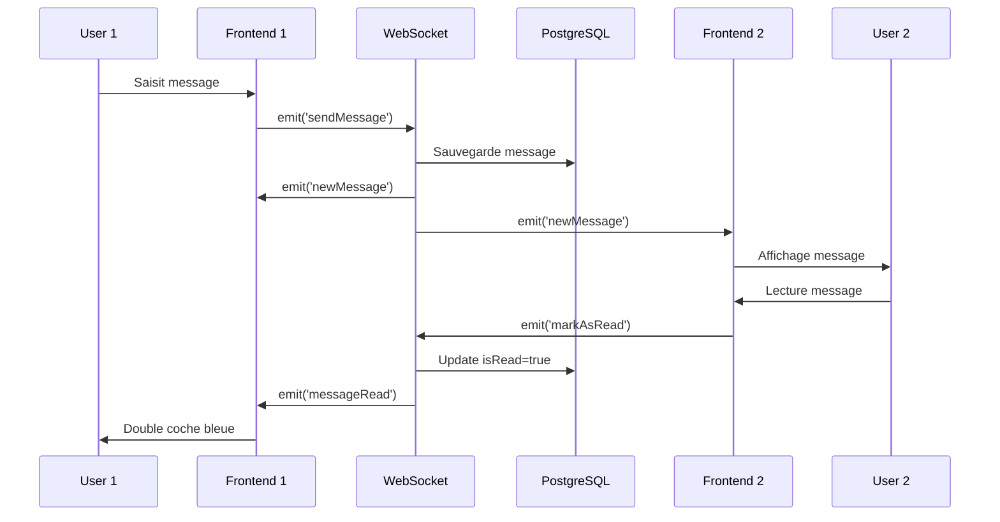

# Description de la fonctionnalité chat - Implémentation Actuelle

Le chat de discussion est un système de messagerie en temps réel de type WhatsApp, respectant la charte graphique et notamment les couleurs et police suivantes : 


## 🎯 Expérience Utilisateur - Workflows Complets

### **1. Parcours Utilisateur Complet**

#### **Étape 1 : Accès depuis le Hub**
- **Page d'accueil** : Carrousel interactif avec 3 modules
- **Sélection Icebreaker** : Carte orange avec description engageante
- **Transition fluide** : Navigation sans rechargement de page
- **Animation d'entrée** : Feedback visuel pour confirmer le choix

#### **Étape 2 : Landing Icebreaker - Sélection Contact**
- **Liste des contacts** : Interface moderne type WhatsApp
- **Informations riches** :
  - Avatar Jdenticon unique et coloré
  - Pseudo "JootserXXXXX" avec numéro croissant
  - Statut en ligne en temps réel (pastille verte/grise)
  - Indicateur "dernière connexion" si hors ligne
- **Actions intuitives** :
  - Recherche dynamique des contacts
  - Filtrage par statut (en ligne/tous)
  - Clic direct pour démarrer conversation
  - Gestion contacts (ajout/suppression)

#### **Étape 3 : Interface de Chat - Expérience Familière**
- **Design WhatsApp-like** : Interface immédiatement reconnaissable
- **Header informatif** :
  - Avatar et nom du contact
  - Statut en ligne en temps réel
  - Bouton retour vers liste contacts
- **Zone de messages** :
  - Bulles colorées selon l'expéditeur
  - Timestamps discrets
  - Accusés de réception visuels (1 et 2 coches)
  - Auto-scroll vers nouveaux messages
- **Barre de saisie** :
  - Input adaptatif (grandit avec le texte)
  - Bouton envoi avec animation
  - Typing indicators pour l'interlocuteur

### **2. Fonctionnalités de Chat Standard**

#### **Messages Temps Réel**
- **Envoi instantané** : Messages apparaissent immédiatement
- **Persistance** : Historique conservé entre sessions
- **Synchronisation** : Même conversation sur tous les appareils
- **États de message** :
  - ⏳ Envoi en cours (animation)
  - ✓ Envoyé (1 coche bleue)
  - ✓✓ Lu (2 coches bleues)
  - ❌ Échec d'envoi (retry automatique)

#### **Indicateurs d'Activité**
- **Typing indicators** : "JootserXXXX est en train d'écrire..."
- **Statuts en ligne** : Mise à jour automatique toutes les 30 secondes
- **Dernière vue** : "Dernière fois en ligne il y a X minutes"
- **Présence conversation** : Indication si l'utilisateur est dans le chat

#### **Interface Responsive**
- **Mobile first** : Optimisé pour smartphones
- **Gestes tactiles** : Scroll fluide, tap optimisé
- **Adaptation écran** : Desktop avec sidebar, mobile fullscreen
- **Performance mobile** : Chargement optimisé pour 3G/4G

### **3. Système Icebreaker - Expérience Révolutionnaire**

#### **3.1 Déclenchement - Bouton Central**
- **Position stratégique** : En bas de l'interface, toujours visible
- **Design attrayant** : Logo Icebreaker circulaire avec animation subtle
- **États visuels clairs** :
  - 🤍 **Blanc** : Prêt à démarrer (état initial)
  - 🟢 **Vert** : Utilisateur actuel est prêt (feedback immédiat)
  - 🟠 **Orange** : En attente de l'autre participant (anticipation)
  - ⚪ **Désactivé** : Pendant le processus de question
- **Feedback haptic** : Vibration sur mobile lors des changements d'état

#### **3.2 Synchronisation des Participants**
- **Attente interactive** : Animation de "pulse" sur le bouton orange
- **Timeout intelligent** : Reset automatique après 5 minutes d'inactivité
- **Notifications subtiles** : Message système quand l'autre est prêt
- **Annulation possible** : Re-clic pour annuler avant que l'autre soit prêt

#### **3.3 Modal de Question - Design Élégant**
- **Apparition fluide** : Slide-down depuis le haut avec ease-in-out
- **Design non-intrusif** : Fond semi-transparent, focus sur la question
- **Contenu riche** :
  - 🏷️ **Catégorie** : Badge coloré avec icône
  - ❓ **Question** : Typographie claire et lisible
  - 🎯 **Options** : Boutons élégants avec états hover/active
  - ✅ **Validation** : Bouton vert, activé seulement après sélection
- **UX optimisée** :
  - Sélection obligatoire avant validation
  - Feedback visuel immédiat sur la sélection
  - Possibilité de fermer avant validation (bouton X)
  - Animations staggered pour les options (apparition décalée)

#### **3.4 Affichage des Résultats - Message Spécial**
- **Intégration chat** : Message spécial dans le flux normal
- **Design distinctif** :
  - 🟠 **Fond orange** : Couleur signature Icebreaker
  - 🎨 **Typographie** : Font Indie Flower pour les réponses
  - 📐 **Layout spécial** : Question en haut, réponses positionnées
- **Structure claire** :
  - **Titre** : Question posée en gras
  - **Réponse personnelle** : Haut gauche, identifiée clairement
  - **Réponse interlocuteur** : Bas droite, nom affiché
- **Gamification visible** :
  - ⭐ **Points XP** : "+10 XP" affiché temporairement
  - 📊 **Progression** : Barre de niveau mise à jour
  - 🏆 **Badges** : Déblocage de récompenses

### **4. Gamification et Engagement**

#### **4.1 Système de Progression**
- **Points d'Expérience** : +10 XP par question Icebreaker complétée
- **Niveaux de conversation** : Progression individuelle par chat
- **Affichage en temps réel** : Barres de progression animées
- **Seuils de déblocage** : Nouvelles fonctionnalités selon le niveau

#### **4.2 Feedback Visuel et Récompenses**
- **Animations célébration** : Confettis lors de montée de niveau
- **Messages d'encouragement** : "Bravo ! Vous progressez bien ensemble !"
- **Historique enrichi** : Sauvegarde de toutes les questions/réponses
- **Statistiques personnelles** : Nombre de questions, sujets préférés

#### **4.3 Motivation Continue**
- **Suggestions intelligentes** : "Vous n'avez pas fait d'Icebreaker depuis 2 jours"
- **Défis quotidiens** : "Répondez à 3 questions aujourd'hui"
- **Comparaison sociale** : "Vous êtes dans le top 10% des utilisateurs actifs"

### **5. Accessibilité et Inclusion**

#### **5.1 Navigation Alternative**
- **Support clavier** : Tab navigation complète
- **Lecteurs d'écran** : ARIA labels sur tous les éléments interactifs
- **Raccourcis clavier** : Enter pour envoyer, Esc pour fermer modals

#### **5.2 Adaptations Visuelles**
- **Contrastes élevés** : Respect des guidelines WCAG 2.1
- **Tailles de police** : Adaptation aux préférences système
- **Mode sombre** : Thème alternatif pour usage nocturne (futur)

#### **5.3 Réduction de Mouvement**
- **Respect preferences** : Désactivation animations si demandé
- **Alternatives statiques** : Fallback sans animation
- **Performance** : Pas de dégradation si animations désactivées

### **6. Gestion d'Erreurs et Récupération**

#### **6.1 Problèmes de Connexion**
- **Reconnexion transparente** : WebSocket auto-reconnect
- **Mode offline** : Messages en attente lors de déconnexion
- **Feedback utilisateur** : Bannière discrète "Reconnexion en cours..."
- **Retry intelligent** : Exponential backoff sans spam

#### **6.2 Erreurs Utilisateur**
- **Messages clairs** : Textes compréhensibles, pas de codes d'erreur
- **Actions suggérées** : "Vérifiez votre connexion" avec bouton "Réessayer"
- **Fallback gracieux** : Fonctionnalités dégradées plutôt que crash complet

#### **6.3 États Exceptionnels**
- **Contact déconnecté** : "JootserXXXX s'est déconnecté pendant l'Icebreaker"
- **Question indisponible** : Sélection alternative automatique
- **Limite de débit** : "Trop de questions, attendez 30 secondes"

## 🏗️ Architecture Technique Implémentée

### **Backend - WebSocket avec Socket.IO**
- **Namespace `/chat`** : Dédié aux conversations
- **Rooms dynamiques** : `conversation-{conversationId}` pour chaque discussion
- **Authentification JWT** : Validation token sur chaque connexion
- **Services** :
  - `ChatGateway` : Gestion WebSocket temps réel
  - `MessagesService` : CRUD messages et persistance
  - `ConversationsService` : Gestion conversations et participants

### **Frontend - React avec Zustand**
- **Store Zustand** : `useChatStore` pour gestion d'état réactive
- **Socket Service** : `ChatSocketService` pour communication temps réel
- **Composants** :
  - `ChatContainer` : Interface principale de chat
  - `MessageBubble` : Bulles de messages avec statuts
  - `MessageInput` : Formulaire de saisie avec typing indicators

## 🚀 Fonctionnement du Chat Implémenté

### **1. Envoi et Réception de Messages**

#### **Côté Client**
```typescript
// 1. Utilisateur saisit un message
const handleSendMessage = (content: string) => {
  chatSocketService.sendMessage({
    conversationId,
    content,
    type: 'TEXT'
  })
}

// 2. Émission via Socket.IO
socket.emit('sendMessage', messageData)
```

#### **Côté Serveur**
```typescript
// 3. Réception et traitement
@SubscribeMessage('sendMessage')
async handleSendMessage(client: Socket, data: SendMessageDto) {
  // Validation et création en BDD
  const message = await messagesService.createMessage(data)
  
  // Diffusion temps réel aux participants
  server.to(`conversation-${conversationId}`).emit('newMessage', message)
}
```

### **2. Persistance et Stockage**

#### **Base de Données PostgreSQL**
```sql
-- Table Messages
Message {
  id: string (UUID)
  conversationId: string (FK)
  senderId: string (FK)
  content: string
  type: MessageType (TEXT, ANSWER, SYSTEM)
  status: MessageStatus (SENT, DELIVERED, READ)
  isRead: boolean
  userAId: string (pour messages Icebreaker)
  userAAnswer: string
  userBId: string
  userBAnswer: string
  createdAt: DateTime
  updatedAt: DateTime
}
```

#### **Cache Redis**
```javascript
// États temporaires
'conversation:{id}:typing' : userId actuellement en train de taper
'message:{id}:status' : Statut de livraison/lecture
```

### **3. Mise à Jour Interface Temps Réel**

#### **Réception Messages**
```typescript
// Event Handler
const handleNewMessage = (message: Message) => {
  chatStore.addMessage(conversationId, message)
  // Mise à jour automatique UI via Zustand
}

// Auto-scroll vers nouveau message
chatSocket.on('newMessage', handleNewMessage)
```

#### **Gestion des États**
```typescript
// Store Zustand réactif
interface ChatStore {
  conversations: Record<string, Conversation>
  activeConversationId: string
  
  // Actions
  addMessage: (conversationId: string, message: Message) => void
  markAsRead: (conversationId: string, messageId: string) => void
  setTyping: (conversationId: string, userId: string, isTyping: boolean) => void
}
```

## ✅ Fonctionnalités Implémentées

### **Accusés de Réception**
- ✅ **1ère coche bleue** : Message envoyé et reçu par le serveur
- ✅ **2ème coche bleue** : Message lu par le destinataire
- ✅ **Mise à jour temps réel** : Statuts via WebSocket

```typescript
// Marquer comme lu
@SubscribeMessage('markAsRead')
async handleMarkAsRead(client: Socket, data: { conversationId: string }) {
  await messagesService.markAsRead(data.conversationId, client.data.userId)
  
  // Notifier l'expéditeur
  server.to(`conversation-${data.conversationId}`).emit('messagesRead', {
    userId: client.data.userId,
    conversationId: data.conversationId
  })
}
```

### **Statuts En Ligne**
- ✅ **Pastille verte** : Utilisateur en ligne
- ✅ **Pastille grise** : Utilisateur hors ligne
- ✅ **Mise à jour temps réel** : Via namespace `/user`

```typescript
// Intégration avec UserGateway
const handleUserStatusChange = (data: UserStatusChange) => {
  if (chatStore.isParticipant(data.userId)) {
    chatStore.updateParticipantStatus(data.userId, data.isOnline)
  }
}
```

### **Typing Indicators**
- ✅ **Indicateur de saisie** : "User est en train d'écrire..."
- ✅ **Debouncing** : Arrêt automatique après 3 secondes d'inactivité

```typescript
// Côté Client - Debounced typing
const debouncedStopTyping = useMemo(
  () => debounce(() => {
    chatSocket.emit('stopTyping', { conversationId })
  }, 3000),
  [conversationId]
)

// Côté Serveur
@SubscribeMessage('typing')
handleTyping(client: Socket, data: { conversationId: string }) {
  client.to(`conversation-${data.conversationId}`).emit('userTyping', {
    userId: client.data.userId,
    isTyping: true
  })
}
```

### **Synchronisation Multi-Device**
- ✅ **Persistance centralisée** : Messages stockés en PostgreSQL
- ✅ **État synchronisé** : Statuts de lecture partagés
- ✅ **Connexions multiples** : Support plusieurs onglets/appareils

## 🎯 Spécificités JOOTS - Système Icebreaker

### **Processus Complet Implémenté**

#### **1. Préparation des Participants**
```typescript
// Bouton "icebreaker ready"
const handleIcebreakerReady = () => {
  chatSocket.emit('icebreakerReady', {
    conversationId,
    isReady: true
  })
  
  // UI : Logo vert/orange
  setIcebreakerStatus('ready')
}
```

#### **2. Synchronisation et Question**
```typescript
// Côté Serveur - Vérification des deux participants
if (areAllParticipantsReady(conversationId)) {
  // Génération question aléatoire
  const questionGroup = await questionService.getRandomQuestion()
  
  // Envoi aux deux participants
  server.to(`conversation-${conversationId}`).emit('icebreakerQuestion', {
    questionGroup,
    options: ['oui', 'non', 'je ne sais pas']
  })
}
```

#### **3. Réponses et Affichage**
```typescript
// Soumission réponse utilisateur
const handleAnswerSubmit = async (optionId: string) => {
  await fetch('/api/icebreakers/response', {
    method: 'POST',
    body: JSON.stringify({
      userId,
      questionGroupId,
      optionId,
      conversationId
    })
  })
}

// Traitement côté serveur
if (areAllParticipantsAnswered(conversationId)) {
  const responses = await getUserAnswers(conversationId, questionGroupId)
  
  // Création message spécial type 'ANSWER'
  const answerMessage = await messagesService.addIcebreakerMessage({
    conversationId,
    questionLabel: question.question,
    userAAnswer: responses.userA.option.label,
    userBAnswer: responses.userB.option.label
  })
  
  // Diffusion aux participants
  server.to(`conversation-${conversationId}`).emit('icebreakerResponses', {
    message: answerMessage
  })
}
```

#### **4. Affichage des Résultats**
- ✅ **Message orange** : Fond coloré pour distinguer des messages normaux
- ✅ **Question affichée** : Texte de la question en titre
- ✅ **Réponses utilisateurs** :
  - Réponse utilisateur actuel : En haut à gauche (font Indie Flower)
  - Réponse interlocuteur : En bas à droite (font Indie Flower)
- ✅ **Reset automatique** : Bouton Icebreaker redevient blanc et actif

## 📊 Performance et Monitoring

### **Métriques Surveillées**
- ✅ **Latence messages** : Temps envoi/réception < 100ms
- ✅ **Connexions actives** : Nombre d'utilisateurs connectés
- ✅ **Throughput** : Messages/seconde par conversation
- ✅ **Erreurs** : Taux d'erreur < 1%

### **Optimisations Implémentées**
- ✅ **Debouncing** : Typing indicators, scroll events
- ✅ **Connection pooling** : PostgreSQL optimisé
- ✅ **Lazy loading** : Messages par pagination
- ✅ **Memoization** : Composants React optimisés

## 🔐 Sécurité Implémentée

### **Authentification & Autorisation**
- ✅ **JWT Validation** : Vérification token sur chaque connexion WebSocket
- ✅ **Room Access Control** : Vérification appartenance conversation
- ✅ **Input Sanitization** : Nettoyage contenu messages
- ✅ **Rate Limiting** : Limitation messages par utilisateur/minute

### **Protection des Données**
- ✅ **Validation stricte** : class-validator sur tous les inputs
- ✅ **CORS sécurisé** : Origines autorisées uniquement
- ✅ **SQL Injection Protection** : Via Prisma ORM
- ✅ **XSS Prevention** : Échappement contenu utilisateur

## 🔄 Flux de Données Complet



Cette implémentation offre une expérience de chat moderne, fluide et sécurisée, avec les spécificités uniques du système Icebreaker pour faciliter les échanges entre inconnus dans un environnement engageant et ludique.