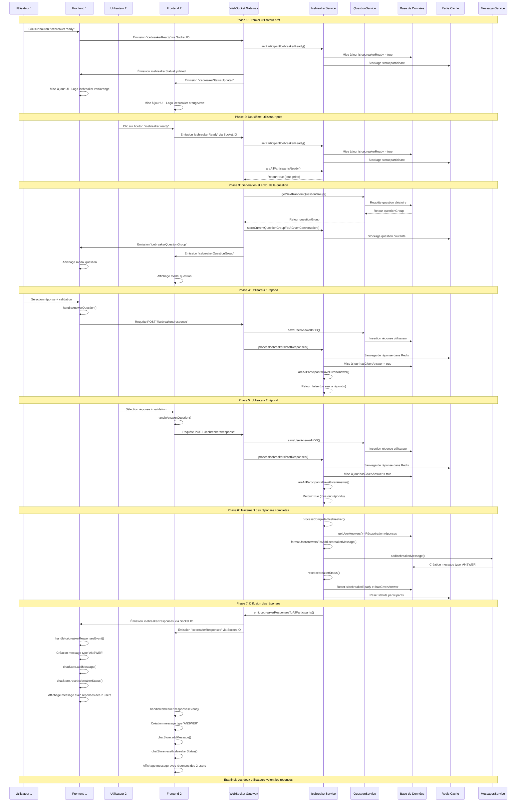

# Diagramme Architectural - Flux Icebreaker

Ce diagramme illustre le flux complet depuis le clic du premier utilisateur sur le bouton "icebreaker ready" jusqu'à l'affichage des réponses des deux utilisateurs dans la conversation.

## Description des composants

### Frontend (React/Next.js)
- **ExperienceLogo.tsx** : Composant du bouton icebreaker ready
- **ChatContainer.tsx** : Gestion de l'affichage des questions et messages
- **chatStore.ts** : Store Zustand pour la gestion d'état des conversations
- **chatEventHandlers.ts** : Gestionnaires d'événements WebSocket

### Backend (NestJS)
- **ChatGateway** : Gateway WebSocket pour la communication temps réel
- **IcebreakerService** : Service métier pour la logique icebreaker
- **QuestionService** : Service de gestion des questions
- **MessagesService** : Service de gestion des messages
- **IcebreakerController** : Contrôleur REST pour les réponses

### Infrastructure
- **PostgreSQL** : Base de données principale
- **Redis** : Cache pour les statuts temporaires et questions courantes
- **Socket.IO** : WebSocket pour la communication temps réel

## Points clés de l'architecture

1. **Communication bidirectionnelle** : WebSocket pour les mises à jour temps réel
2. **Persistance hybride** : PostgreSQL pour les données permanentes, Redis pour les états temporaires
3. **Synchronisation** : Tous les participants reçoivent les mêmes événements simultanément
4. **Gestion d'état** : Reset automatique des statuts après traitement complet
5. **Type de message spécial** : Messages 'ANSWER' qui contiennent les réponses des deux utilisateurs 