# Diagramme UML - Architecture JootsHub

Ce diagramme UML présente l'architecture complète du projet JootsHub avec les entités principales, services et leurs relations.

## Diagramme de Classes

```mermaid
classDiagram
    %% === ENTITÉS UTILISATEUR ===
    class User {
        +string id
        +string email
        +string firstName
        +string lastName
        +string avatar
        +Date createdAt
        +Date updatedAt
        +getFullName() string
        +getInitials() string
    }

    %% === ENTITÉS CONVERSATION ===
    class Conversation {
        +string id
        +string locale
        +int experiencePoints
        +int level
        +Date createdAt
        +Date updatedAt
        +ConversationParticipant[] participants
        +Message[] messages
        +Message lastMessage
        +int unreadCount
        +string currentQuestionGroup
        +addParticipant(userId: string)
        +removeParticipant(userId: string)
        +addMessage(message: Message)
        +calculateLevel() int
    }

    class ConversationParticipant {
        +string conversationId
        +string userId
        +boolean isTyping
        +boolean isIcebreakerReady
        +boolean hasGivenAnswer
        +string icebreakerTimestamp
        +IcebreakerResponse response
        +Date createdAt
        +Date updatedAt
        +setReady(ready: boolean)
        +setAnswered(answered: boolean)
    }

    class Message {
        +string id
        +string conversationId
        +string senderId
        +string receiverId
        +string content
        +MessageType type
        +MessageStatus status
        +boolean isRead
        +string userAId
        +string userAAnswer
        +string userBId
        +string userBAnswer
        +Date createdAt
        +Date updatedAt
        +markAsRead()
        +updateStatus(status: MessageStatus)
    }

    %% === ENTITÉS QUESTIONS ===
    class QuestionGroup {
        +string id
        +string category
        +int difficulty
        +Question[] questions
        +QuestionOption[] options
        +Date createdAt
        +Date updatedAt
        +getLocalizedQuestion(locale: string) Question
        +getRandomOption() QuestionOption
    }

    class Question {
        +string id
        +string questionGroupId
        +string question
        +string locale
        +Date createdAt
        +Date updatedAt
    }

    class QuestionOption {
        +string id
        +string questionGroupId
        +string label
        +string locale
        +int order
        +Date createdAt
        +Date updatedAt
    }

    class UserAnswer {
        +string id
        +string userId
        +string questionGroupId
        +string optionId
        +string conversationId
        +Date answeredAt
        +Date createdAt
        +Date updatedAt
    }

    %% === TYPES ET ENUMS ===
    class MessageType {
        <<enumeration>>
        TEXT
        ANSWER
        SYSTEM
        NOTIFICATION
    }

    class MessageStatus {
        <<enumeration>>
        SENT
        DELIVERED
        READ
    }

    class IcebreakerResponse {
        +string questionGroupId
        +string optionId
        +string answeredAt
    }

    %% === SERVICES BACKEND ===
    class ChatGateway {
        <<service>>
        -PrismaService prisma
        -RedisService redis
        -IcebreakerService icebreakerService
        -QuestionService questionService
        +handleIcebreakerReady(data: any)
        +handleJoinConversation(conversationId: string)
        +handleSendMessage(data: any)
        +emitIcebreakerStatusUpdate(conversationId: string, userId: string, isReady: boolean)
        +triggerIcebreakerQuestion(conversationId: string)
        +emitIcebreakerResponsesToAllParticipants(data: any)
    }

    class IcebreakerService {
        <<service>>
        -PrismaService prisma
        -RedisService redis
        -ChatGateway chatGateway
        -MessagesService messagesService
        +setParticipantIcebreakerReady(conversationId: string, userId: string, isReady: boolean)
        +areAllParticipantsReady(conversationId: string) boolean
        +processIcebreakersPostResponses(userId: string, questionGroupId: string, optionId: string, conversationId: string)
        +storeCurrentQuestionGroupForAGivenConversation(conversationId: string, questionGroup: QuestionGroup)
        +resetIcebreakerStatus(conversationId: string)
        +emitResponsesToAllParticipants(data: any)
    }

    class QuestionService {
        <<service>>
        -PrismaService prisma
        +getNextRandomQuestionGroup(userId1: string, userId2: string) QuestionGroup
        +getQuestionGroup(id: string) QuestionGroup
        +saveUserAnswerInDB(userId: string, questionGroupId: string, optionId: string, conversationId: string) UserAnswer
    }

    class MessagesService {
        <<service>>
        -PrismaService prisma
        +addIcebreakerMessage(conversationId: string, questionLabel: string, userAnswerA: any, userAnswerB: any)
        +markAsRead(conversationId: string, userId: string)
    }

    class ConversationsService {
        <<service>>
        -PrismaService prisma
        +addXpAndComputeLevel(conversationId: string) ProgressionResult
        +getConversationById(id: string) Conversation
        +createConversation(participants: string[]) Conversation
    }

    %% === STORES FRONTEND (ZUSTAND) ===
    class ChatStore {
        <<store>>
        +conversations: Record~string, Conversation~
        +activeConversationId: string
        +error: string
        +setActiveConversation(conversationId: string)
        +addMessage(conversationId: string, message: Message)
        +updateParticipantField(conversationId: string, participantId: string, field: string, value: any)
        +resetIcebreakerStatus(conversationId: string)
        +getParticipant(conversationId: string, userId: string) ConversationParticipant
        +getOtherParticipant(conversationId: string, userId: string) ConversationParticipant
    }

    class UserStore {
        <<store>>
        +user: User
        +isAuthenticated: boolean
        +setUser(user: User)
        +logout()
        +updateProfile(data: Partial~User~)
    }

    %% === SERVICES FRONTEND ===
    class IcebreakerServiceFrontend {
        <<service>>
        +fetchRandomQuestionGroup(conversationId: string) QuestionGroup
        +submitIcebreakerResponse(userId: string, questionGroupId: string, optionId: string, conversationId: string)
    }

    class SocketManager {
        <<service>>
        -socket: Socket
        +connect()
        +disconnect()
        +sendIcebreakerReady(conversationId: string, isReady: boolean)
        +onIcebreakerStatusUpdated(callback: Function)
        +onIcebreakerQuestionGroup(callback: Function)
        +onIcebreakerResponses(callback: Function)
    }

    %% === RELATIONS ===
    User ||--o{ ConversationParticipant : "participe à"
    Conversation ||--o{ ConversationParticipant : "contient"
    Conversation ||--o{ Message : "contient"
    User ||--o{ Message : "envoie"
    User ||--o{ UserAnswer : "répond"
    
    QuestionGroup ||--o{ Question : "contient"
    QuestionGroup ||--o{ QuestionOption : "contient"
    QuestionGroup ||--o{ UserAnswer : "génère"
    QuestionOption ||--o{ UserAnswer : "sélectionnée dans"
    
    Message ||--|| MessageType : "a un type"
    Message ||--|| MessageStatus : "a un statut"
    ConversationParticipant ||--o| IcebreakerResponse : "peut avoir"
    
    %% Services Backend
    ChatGateway ..> IcebreakerService : "utilise"
    ChatGateway ..> QuestionService : "utilise"
    IcebreakerService ..> MessagesService : "utilise"
    IcebreakerService ..> ConversationsService : "utilise"
    
    %% Services Frontend
    ChatStore ..> SocketManager : "utilise"
    IcebreakerServiceFrontend ..> ChatStore : "met à jour"
    
    %% Relations avec les entités
    ChatGateway ..> Conversation : "gère"
    ChatGateway ..> Message : "traite"
    IcebreakerService ..> ConversationParticipant : "modifie"
    QuestionService ..> QuestionGroup : "sélectionne"
    QuestionService ..> UserAnswer : "sauvegarde"
```

## Diagramme d'États - Flux Icebreaker

```mermaid
stateDiagram-v2
    [*] --> ConversationActive : Conversation démarrée
    
    ConversationActive --> WaitingForReady : Premier utilisateur prêt
    WaitingForReady --> BothReady : Deuxième utilisateur prêt
    
    BothReady --> QuestionSent : Question générée et envoyée
    
    QuestionSent --> WaitingFirstAnswer : Premier utilisateur répond
    WaitingFirstAnswer --> BothAnswered : Deuxième utilisateur répond
    
    BothAnswered --> ProcessingAnswers : Traitement des réponses
    ProcessingAnswers --> ResponsesDisplayed : Affichage des réponses
    
    ResponsesDisplayed --> ConversationActive : Reset pour nouvelle question
    
    note right of BothReady
        Tous les participants 
        sont prêts pour l'icebreaker
    end note
    
    note right of BothAnswered
        Traitement automatique
        quand les 2 réponses
        sont reçues
    end note
```



## Diagramme Entité-Relation (Base de Données)

```mermaid
erDiagram
    User {
        string id PK
        string email UK
        string firstName
        string lastName
        string avatar
        datetime createdAt
        datetime updatedAt
    }
    
    Conversation {
        string id PK
        string locale
        int experiencePoints
        int level
        datetime createdAt
        datetime updatedAt
    }
    
    ConversationParticipant {
        string conversationId PK, FK
        string userId PK, FK
        boolean isTyping
        boolean isIcebreakerReady
        boolean hasGivenAnswer
        datetime icebreakerTimestamp
        datetime createdAt
        datetime updatedAt
    }
    
    Message {
        string id PK
        string conversationId FK
        string senderId FK
        string receiverId FK
        string content
        enum messageType
        enum status
        boolean isRead
        string userAId FK
        string userAAnswer
        string userBId FK
        string userBAnswer
        datetime createdAt
        datetime updatedAt
    }
    
    QuestionGroup {
        string id PK
        string category
        int difficulty
        datetime createdAt
        datetime updatedAt
    }
    
    Question {
        string id PK
        string questionGroupId FK
        string question
        string locale
        datetime createdAt
        datetime updatedAt
    }
    
    QuestionOption {
        string id PK
        string questionGroupId FK
        string label
        string locale
        int order
        datetime createdAt
        datetime updatedAt
    }
    
    UserAnswer {
        string id PK
        string userId FK
        string questionGroupId FK
        string optionId FK
        string conversationId FK
        datetime answeredAt
        datetime createdAt
        datetime updatedAt
    }
    
    %% Relations
    User ||--o{ ConversationParticipant : "participe"
    Conversation ||--o{ ConversationParticipant : "contient"
    Conversation ||--o{ Message : "contient"
    User ||--o{ Message : "envoie"
    User ||--o{ UserAnswer : "répond"
    
    QuestionGroup ||--o{ Question : "contient"
    QuestionGroup ||--o{ QuestionOption : "contient"
    QuestionGroup ||--o{ UserAnswer : "pour"
    QuestionOption ||--o{ UserAnswer : "sélectionnée"
    
    Message }|--|| User : "sender"
    Message }|--|| User : "receiver"
    Message }|--|| User : "userA"
    Message }|--|| User : "userB"
```



## Architecture en Couches


## Description des Composants

### 🎯 **Entités Principales**
- **User** : Utilisateurs de la plateforme
- **Conversation** : Conversations entre utilisateurs avec système XP/niveau
- **Message** : Messages échangés (texte normal ou réponses icebreaker)
- **QuestionGroup** : Groupes de questions pour les icebreakers

### 🔧 **Services Backend**
- **ChatGateway** : Gestion WebSocket temps réel
- **IcebreakerService** : Logique métier des icebreakers
- **QuestionService** : Gestion des questions et réponses
- **MessagesService** : Gestion des messages

### 📱 **Frontend Architecture**
- **Stores Zustand** : Gestion d'état réactive
- **Services** : Couche d'abstraction API
- **SocketManager** : Gestion WebSocket côté client

### 🗄️ **Persistance**
- **PostgreSQL** : Base de données principale
- **Redis** : Cache pour les états temporaires
- **Prisma** : ORM pour l'accès aux données